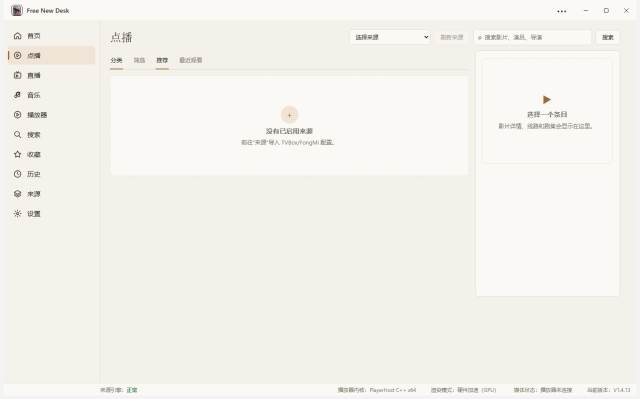
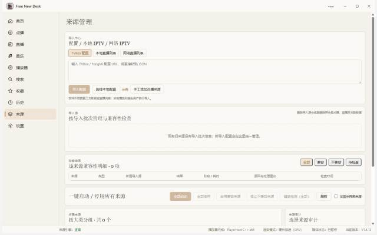
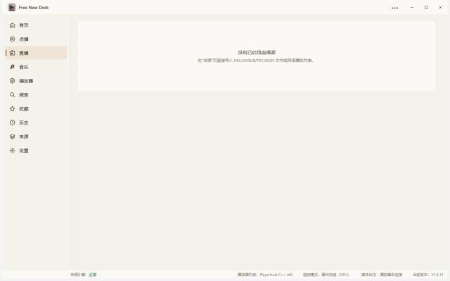

# Free New Desk

> 把 TVBox / FongMi 的「味儿」搬到 Windows 11 桌面 —— 一个**空壳**播放器，所有内容来自你自己配置的来源。
Free New Desk 是一个面向 **Windows 11 x64** 的 TVBox / FongMi 风格桌面影音播放器。软件本身**不内置任何第三方影视源**，只提供用户自有或已获授权配置的导入、解析、直播、节目表与播放能力。

## 一眼看完

| **桌面原生** — Electron 渲染层与 C++ `PlayerHost` 播放器子进程隔离，硬件加速 (GPU) 渲染 |
|---|
| **空壳立场** — 不内置、不推荐任何第三方影视源，所有内容由用户自行配置并对合规负责 |
| **兼容 TVBox / FongMi** — 直接粘贴配置 URL 或 sites / lives JSON；CMS、Type4、JS Spider、Drpy 等多协议解析 |
| **本地内嵌播放** — 原生 mpv 视频窗口嵌入主窗口；H.264 / HEVC / HLS / DASH / MPEG-TS，硬件解码与字幕/音轨齐全 |
| **直播 + EPG** — M3U / TXT / JSON、IPTV 线路、XMLTV 节目单、线路回退、最近节目与预约 |
| **来源审计** — 按来源分组、整组启停、Source Audit / JSON 报告导出，便于评估第三方来源质量 |
| **Windows 11 Fluent 风格** — 暗色主题、x64 单实例、可在「设置 → 自动更新」内检查 Release |
| **最小依赖** — Node 24 + LGPL libmpv（已内置到发行包，无需额外安装 VLC / FFmpeg） |

## 界面预览

<table>
<tr>
<td width="33%"> <em>点播：分类筛选 / 最近观看 / 推荐海报</em></td>
<td width="33%"> <em>来源管理：按批次导入 + 兼容性明细</em></td>
<td width="33%"> <em>直播：频道列表 + EPG 节目单 + 内嵌预览</em></td>
</tr>
</table>

## 快速开始

**1. 下载**

前往 [Releases](../../releases) 下载 v1.4.9 的 Windows x64 安装包：

| 包 | 用途 |
| --- | --- |
| `Free New Desk-Setup-1.4.9-x64.exe` | NSIS 安装版（推荐，支持自动更新） |
| `Free New Desk-Portable-1.4.9-x64.exe` | 绿色版（无需安装，解压即用） |

**2. 安装**

- 系统：Windows 11 x64（Windows 10 x64 理论可运行，建议升级 11）
- 无需额外安装播放器或运行时（libmpv 已内置）
- 可选：若要运行纯 JAR 来源，请准备 Java 17+

**3. 首次启动**

软件打开后默认无任何影视内容。请进入「来源」页：

- **粘贴 TVBox / FongMi 配置 URL**（或 sites JSON），或
- **选择本地配置文件**（支持相对路径、注释与尾逗号），或
- **导入 M3U / TXT / JSON 直播列表**

导入后会显示来源兼容性明细与健康检查结果，便于一键剔除不可用来源。

## 主要功能

- **点播**：分类、筛选、分页、搜索、详情、收藏、历史、剧集列表与播放线路
- **直播**：M3U / TXT / JSON、IPTV 频道、线路回退、XMLTV / gzip EPG、节目预约与直播收藏
- **搜索聚合**：多源并发检索，结果只显示可播放条目
- **播放器**：硬件解码、字幕 / 音轨 / 倍速 / 画面比例 / 截图 / 全屏 / PiP / 播放队列
- **来源管理**：分组启用、整组启停、批量替换、健康检测、Source Audit / JSON 审计报告导出
- **设置**：稳定版 / 每日更新通道、缓存分项清理、日志目录、JVM / Plugin / libmpv 诊断
- **自动更新**：仅检查本仓库 GitHub Releases；安装版支持自更新

## 安全与边界

- 渲染进程：`nodeIntegration: false` / `contextIsolation: true` / `sandbox: true` / `webSecurity: true`
- JS Spider、JAR Spider、Plugin 均不进入 Renderer；可执行来源按 Level B 处理，默认不自动启用
- 来源网络统一经 RequestBroker，Cookie 按 `sourceId + host` 隔离
- 日志不输出 Cookie / Authorization / Token / 完整播放地址
- **不内置任何第三方影视源**，不接管或转发任何更新地址
- 使用本软件即视为同意：你自行配置的内容由你本人承担合法合规责任；开发者不为第三方来源提供任何内容或背书

## 致谢与第三方

Free New Desk 是站在巨人肩膀上的空壳播放器，依赖以下开源生态：

- TVBox / FongMi / 猫影视 — 接口与配置格式生态
- [Electron](https://www.electronjs.org) — 桌面应用框架
- [libmpv](https://mpv.io) — LGPL 视频解码引擎（运行时固定来源版本）
- [Vue](https://vuejs.org) / TypeScript / Vite — 渲染层技术栈
- 所有 TVBox / FongMi 配置与 Spider 作者

第三方组件与 libmpv 构建来源详见 [THIRD_PARTY_NOTICES.md](THIRD_PARTY_NOTICES.md)。

## 反馈与贡献

- Bug 反馈与功能建议：[Issues](../../issues)
- 当前快照版本：**v1.4.9**（2026-09-05）
- 公共发布仓库：本仓库

## 许可证

本仓库自身许可证见 [LICENSE](LICENSE)。本软件按「原样」提供，不提供任何明示或暗示的担保。
