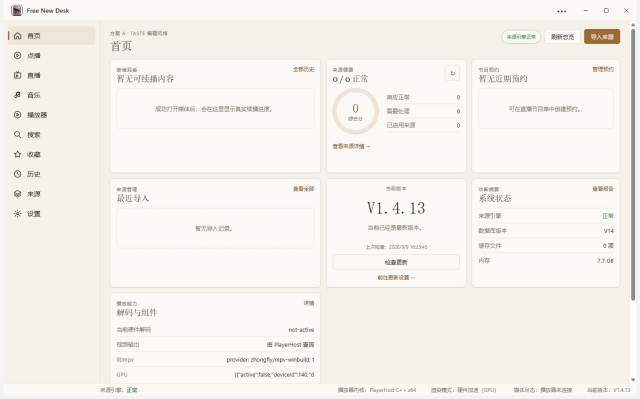
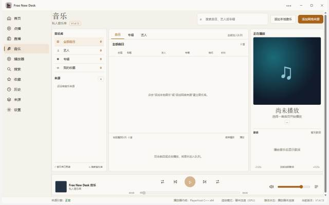
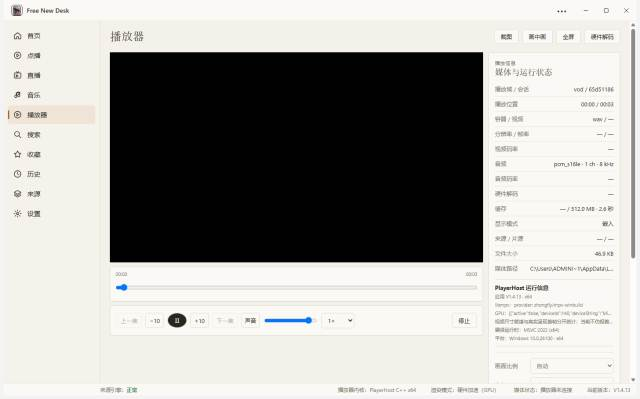

# Free New Desk

> 面向 Windows 11 x64 的 TVBox / FongMi 风格桌面影音播放器。
> **软件本身不内置任何第三方影视源**，影视内容由用户自行导入；本地音乐、NAS、SMB、WebDAV 也可以直接加入音乐库。

**当前稳定版：V1.4.17** ｜ [下载 Release](../../releases/tag/v1.4.17) ｜ [问题反馈](../../issues)

## V1.4.17：播放可靠性与公开发行收口

如果你还在使用 **V1.4.9** 或更早版本，建议直接升级到 **V1.4.17**。本版重点是播放会话可靠性、来源解析兼容性和公开版发布配置。

| 升级重点 | V1.4.17 的变化 |
| --- | --- |
| **播放更稳** | 直播只在确认终止或失联后按受限预算恢复；播放器统计按会话身份和时效消费，避免旧采样覆盖当前状态。 |
| **音乐库大升级** | 支持本地 / SMB / WebDAV 音乐库，完善曲目与艺人封面、手动封面、在线同步歌词、播放时钟、队列和进度记忆。 |
| **NAS / SMB 更可靠** | 新增 Windows 原生 `smb-helper`，改善共享目录连接、凭据切换、冲突处理和错误提示。 |
| **来源解析与打包** | 嗅探候选会验证 HTTP 响应和媒体类型；Setup / Portable 使用公共应用标识与公共仓库更新地址。 |

## 界面预览

下面截图展示公开版的主要界面。公共版默认没有内置影视源，所以首次启动看到的是干净的“空壳”状态；导入自己的 TVBox / FongMi / IPTV 配置后即可使用。

<table>
<tr>
<td width="50%"> <em>首页：版本、来源、系统状态与快速入口</em></td>
<td width="50%"> <em>音乐：本地 / SMB / WebDAV、封面、歌词与播放队列</em></td>
</tr>
<tr>
<td width="50%"> <em>播放器：原生 PlayerHost / libmpv、硬件解码与播放控制</em></td>
<td width="50%"> <em>来源管理：配置导入、兼容性检查与批量管理</em></td>
</tr>
</table>

## 主要功能

- **点播**：分类、筛选、分页、搜索、详情、收藏、历史、剧集与播放线路。
- **直播**：M3U / TXT / JSON、IPTV 多线路、XMLTV / gzip EPG、频道收藏与节目预约。
- **播放器**：原生 C++ PlayerHost + LGPL libmpv，支持硬件解码、字幕、音轨、倍速、全屏、PiP、截图和稳定 Seek。
- **音乐**：本地 / SMB / WebDAV 音乐库、曲目/艺人封面、手动封面、在线同步歌词、播放队列和进度记忆。
- **来源管理**：TVBox / FongMi 配置导入、来源分组、批量启停、健康检查、Source Audit 与 JSON 报告导出。
- **兼容能力**：CMS XML / JSON、Type4、JS Spider、Drpy / Drpy2、XYQ、XBPQ，以及可选 JVM Spider / Plugin Host。
- **自动更新**：只检查本公共仓库的 GitHub Releases，不连接旧项目或第三方更新地址。

## 下载与安装

前往 [V1.4.17 Release](../../releases/tag/v1.4.17) 下载 Windows x64 版本：

| 文件 | 适合谁 |
| --- | --- |
| `Free-New-Desk-Setup-1.4.17-x64.exe` | **推荐**：正常安装使用，可配合应用内更新检查。 |
| `Free-New-Desk-Portable-1.4.17-x64.exe` | 便携版：不需要安装，适合测试或随身使用。 |

系统建议：**Windows 11 x64**。Windows 10 x64 理论可运行，但主要开发与实测环境为 Windows 11。libmpv 已随发行包提供，无需另外安装 VLC / FFmpeg。

## 首次使用

影视部分默认没有内容。进入「来源」页面后，你可以：

- 粘贴自己的 TVBox / FongMi 配置 URL 或 JSON；
- 选择本地配置文件；
- 导入 M3U / TXT / JSON 直播列表。

音乐部分可直接添加本地文件夹，也可以添加 **SMB / WebDAV** 网络音乐库。若使用纯 JVM JAR 来源，请另外准备 Java 17+。

## V1.4.17 发布验证

发布前会在本地完成以下验证，并将结果随 Release 说明发布：

- 公开版去标识化检查、架构检查与 TypeScript 检查；
- 播放可靠性、运行时和音乐模块的相关回归；
- Windows x64 Setup / Portable 打包与隔离启动烟测；
- `player-host.exe`、`smb-helper.exe` 与固定版本 libmpv 的发行包完整性。

## 公共版原则

- **不内置、不推荐任何第三方影视源**；所有影视来源由用户自行配置并对合法合规负责。
- 公共仓库不包含私有规则、真实第三方源测试夹具、Token 或私有 CI 配置。
- JS Spider、JAR Spider 与 Plugin 不进入 Renderer；Renderer 保持 `contextIsolation`、Sandbox 与 WebSecurity 隔离。

## 开发、反馈与许可

开发与验证说明见 [docs/README-dev.md](docs/README-dev.md)，第三方组件说明见 [THIRD_PARTY_NOTICES.md](THIRD_PARTY_NOTICES.md)。

- Bug 与功能建议：[Issues](../../issues)
- 当前稳定版：**V1.4.17**
- 公共仓库：`cwe88108/free-new-desk-public`

本仓库自身许可证见 [LICENSE](LICENSE)。软件按“原样”提供，不对用户自行配置的第三方内容作任何背书或担保。
